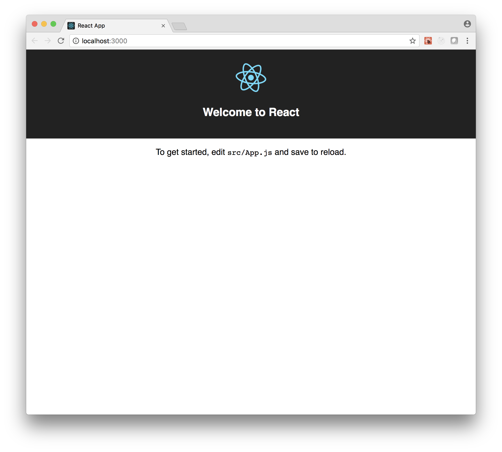

# Step 1

Let's get all dependencies from npm to have this step working.

`npm install`

Then, start the developer preview of app.

`npm start`

You should have Your app visible at the following address:

http://localhost:3000

# Visual effect

